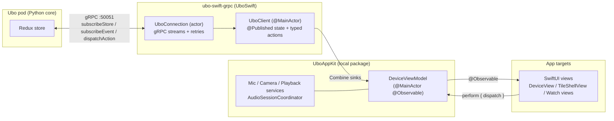

# Ubo Apple Apps

Native Apple clients (iOS / iPadOS / macOS / tvOS / watchOS, with visionOS
compiling as an iPad-style variant) for the [Ubo pod](https://getubo.com) —
a Raspberry Pi-based device running the `ubo_app` Python core.

## Table of contents

- [What these apps are](#what-these-apps-are)
- [Targets and platforms](#targets-and-platforms)
- [Architecture](#architecture)
- [Code layout and the sharing rule](#code-layout-and-the-sharing-rule)
- [Implementation decisions](#implementation-decisions)
- [Building and running](#building-and-running)
- [Testing](#testing)
- [Known gaps / backlog](#known-gaps--backlog)

## What these apps are

The apps are **thin remote clients**. The pod's Redux store computes
everything — menu structure, navigation state, notification contents, even
which view is on screen. Clients:

1. subscribe to the store over gRPC (via the sibling
   [`ubo-swift-grpc`](../ubo-swift-grpc) package),
2. render the streamed **`ViewData`** (a serializable description of the
   current screen: home / menu / notification / instruction / prompt /
   render / chat / application), and
3. dispatch **actions** back (key presses, menu selections, volume, input
   form responses, …).

There is deliberately **no business logic in the clients**. If you find
yourself computing menu state locally, you've taken a wrong turn — dispatch
an action and let the core's reducer decide. This mirrors the pod's other
clients (Kivy GUI, Web UI, TUI, Android), which all follow the same
contract.

Beyond rendering, clients contribute **hardware the pod lacks**:

- **Microphone streaming** — push-to-talk streams PCM16 @ 16 kHz to the
  core's assistant pipeline, tagged with a persistent per-install
  `audioSource` id (`ios:<uuid>` / `watch:<uuid>`) so the core binds the
  listening session to exactly one mic.
- **Remote camera** — the phone/Mac registers as a camera source; when the
  pod's picker selects it, the app streams center-cropped 240×240 RGB
  frames (~12 FPS) for QR scanning / viewfinder display.
- **Audio playback** — the device's chimes and TTS play through the
  client's speaker via a playback-event subscription.

## Targets and platforms

One Xcode project (`ubo-swift-app.xcodeproj`), four targets:

| Target | Platforms | Notes |
|---|---|---|
| `ubo-swift-app` | iOS, iPadOS, macOS, tvOS (visionOS designed-for-iPad) | Single multiplatform target; platform differences via `#if os(...)` |
| `ubo Watch App` | watchOS | Independent app (connects to the pod itself, not through the phone) |
| `UboWidgetsExtension` | iOS/macOS | Home-screen widgets showing CPU/RAM/temperature via app-group storage |
| test targets | — | See [Testing](#testing) |

**Two shells** render the same `ViewData` stream:

- **`DeviceView`** — touch-first UI (iPhone/iPad/visionOS): navigation
  stack, cards, toolbar buttons.
- **`TileShellView`** — focus-driven shell (macOS/tvOS): a tile grid with a
  single custom focus model spanning tiles + control bar, driven by arrow
  keys / the Siri Remote. It intentionally mirrors the Web UI's keyboard
  model (see [Focus and keyboard](#focus-and-keyboard-macostvos)).

The seven `ViewData` cases whose rendering is shell-independent go through
one shared component (`StandardViewContent`); only home/menu differ per
shell (cards vs focus tiles).

## Architecture



State flows one way: `UboClient` exposes Combine `@Published` properties
(`connectionState`, `currentView`, `statusBar`, `systemStats`,
`activeInputs`, `stack`, `lastError`); **`DeviceViewModel`** (in
`UboAppKit`) mirrors them into `@Observable` properties that SwiftUI views
read via `@Environment(DeviceViewModel.self)`. One `DeviceViewModel`
instance is created in each app entry point and injected app-wide.

Actions flow the other way: views call
`viewModel.perform("label") { try await viewModel.client.someAction() }`.
`perform` is the **error-surfacing convention** — it logs failures via
`UboLog` and stores them in `lastError`. Never write
`Task { try? await ... }` for a user-facing action; a failed reboot that
does nothing silently is a bug. In already-async contexts (e.g.
`.refreshable`), use `do { ... } catch { viewModel.report("label", error) }`.

### Services (UboAppKit)

- **`MicCaptureService`** — `AVAudioEngine` input tap → `AVAudioConverter`
  to PCM16/16 kHz → `reportAudioSample` per buffer.
- **`AudioPlaybackService`** — subscribes to playback events; one-shot
  samples and indexed *sequence chunks* (TTS) with a reorder buffer
  (`merge` step is pure and unit-tested); converts wire PCM into the
  engine's canonical deinterleaved float32.
- **`AudioSessionCoordinator`** — the **only** place that touches
  `AVAudioSession` (iOS/watchOS). Capture ending *restores the playback
  category*; it never calls `setActive(false)`, which would tear the shared
  session out from under playback.
- **`CameraManager` / `CameraCaptureService`** — viewfinder lifecycle is
  driven by the pod (start/stop viewfinder events filtered by
  `cameraSourceId`); frames are coalesced through a lock-guarded
  single-slot buffer, and dispatch is paced at ~12 FPS. Threading contracts
  are documented at the top of each file — read them before editing.
- **Assistant gating** — `DeviceViewModel.assistantListening` is the single
  gate for every mic entry point (toolbar mic, Watch PTT, macOS `V`
  push-to-talk key, tvOS device-routed toggle) so entry points can't
  interleave and desync.

### Widgets

`DeviceViewModel` throttles stats into `SharedSystemStats`, persisted as
JSON in the app-group `UserDefaults`
(`group.com.getubo.ubo-swift-app`), and pokes `WidgetCenter`. The widget
extension links **only `UboAppShared`** (never the gRPC stack) and reads
the same struct back. Data older than 5 minutes renders as stale.

## Code layout and the sharing rule

```
ubo-swift-app/
├── Packages/UboAppKit/          ← local SwiftPM package, two products:
│   ├── Sources/UboAppShared/    ← widget-safe, no gRPC dep:
│   │                              UboConstants, SharedSystemStats, Markup,
│   │                              Extensions, UboSymbolMapper, UboDeeplink
│   ├── Sources/UboAppKit/       ← DeviceViewModel, audio/camera services,
│   │                              NotificationItems, ViewChrome
│   │                              (re-exports UboAppShared)
│   └── Tests/UboAppKitTests/    ← unit tests (run with `swift test`)
├── ubo-swift-app/               ← multiplatform app: Views/, Resources/,
│                                  ContentView, app entry
├── ubo Watch App/               ← watchOS views + entry (Views/, Resources/)
├── UboWidgets/                  ← widget extension (imports UboAppShared)
└── ubo-swift-app.xcodeproj      ← folder-synchronized groups (objectVersion 77)
```

**The sharing rule (important):** anything used by more than one target
lives in `Packages/UboAppKit` — *never* copy a file between targets. The
Watch app was once a hand-forked copy of the iOS sources; the forks drifted
(silent error handling, missing fixes) and were merged back into the
package. Platform differences belong in `#if os(...)` branches inside the
shared file. App code only ever writes `import UboAppKit` (which re-exports
`UboAppShared`); the widget imports `UboAppShared`.

The Xcode project uses **folder-synchronized groups**: target membership
is the directory tree, so adding/removing files on disk is sufficient — no
pbxproj editing for ordinary file changes.

## Implementation decisions

Decisions that aren't obvious from the code, with their reasons:

- **One multiplatform target instead of per-platform targets.** The
  overwhelming majority of view code is identical; `#if os` branches are
  concentrated in the shells and services. A per-platform split would
  recreate the copy-drift problem the shared package just eliminated.
- **Local package references.** Both `ubo-swift-grpc` (as `../ubo-swift-grpc`)
  and `UboAppKit` are local SwiftPM references, so changes to the gRPC
  layer are picked up without pushing/pinning. CI or release builds that
  need reproducibility should pin `ubo-swift-grpc` by revision instead.
- **Combine → `@Observable` bridge.** `UboClient` predates `@Observable`
  and publishes via Combine; `DeviceViewModel` mirrors into `@Observable`
  stored properties because SwiftUI observation of `@Published` through
  `@Environment` is clumsier. Both layers are `@MainActor`, so the sinks
  need no queue hopping.
- **Rendering markup.** The core emits Kivy/BBCode-style markup
  (`[b]…[/b]`, `[color=#hex]…[/color]`). `markupText()` honours it,
  `stripMarkup()` removes it for titles/accessibility. The parser is in
  `UboAppShared` and unit-tested — extend it there, not with regexes at
  call sites.
- **Icon rendering.** Menu icons are Nerd Font private-use glyphs.
  `UboIconFontBootstrap` registers the bundled font via CoreText at launch;
  `IconView`/`WatchIconView` render glyphs directly and fall back to SF
  Symbols via the single `UboSymbolMapper` for plain-name icons.
- **Deep link hand-off (`ubo://input?...`).** Apple TV can't type: when an
  input form demands text, the TV shows a QR code encoding its pod
  connection + input id. Scanning it opens the iPhone app, which connects
  to the same pod; input forms are shared state (`active_inputs` streams to
  every client), so the phone's form auto-presents. See `UboDeeplink`.

### Focus and keyboard (macOS/tvOS)

`TileShellView` deliberately does **not** use SwiftUI's native focus
engine for the tile grid; macOS `Button`s aren't focusable without Full
Keyboard Access, and tvOS's engine can't span the custom control bar. The
shell owns a single `focused` state, renders highlights manually, and
dispatches keys itself:

- Arrows move focus; Enter/Space selects; `Esc` goes back; `h` home,
  `m` mute, `v` (hold) push-to-talk.
- **Backspace on macOS** never reaches `.onKeyPress` (AppKit's responder
  chain eats it) — `BackspaceBackHandler` installs an `NSEvent` local
  monitor for keyCode 51, skipping text fields. Don't "simplify" this back
  to `.onKeyPress(.delete)`; it will silently stop working.
- Chained `.onKeyPress` modifiers only deliver to the first handler — use
  a single `.onKeyPress(keys:)` set per view.

## Building and running

Prereqs: Xcode 26+, both repos cloned side-by-side (the project references
`../ubo-swift-grpc`), simulator runtimes installed for the platforms you
target.

```bash
# macOS
xcodebuild -project ubo-swift-app.xcodeproj -scheme ubo-swift-app \
  -destination 'platform=macOS' build

# iOS / tvOS simulators
xcodebuild -project ubo-swift-app.xcodeproj -scheme ubo-swift-app \
  -destination 'generic/platform=iOS Simulator' build
xcodebuild -project ubo-swift-app.xcodeproj -scheme ubo-swift-app \
  -destination 'generic/platform=tvOS Simulator' build

# watchOS simulator
xcodebuild -project ubo-swift-app.xcodeproj -scheme 'ubo Watch App' \
  -destination 'generic/platform=watchOS Simulator' build
```

Gotchas learned the hard way:

- **Never force `-sdk`** — let the `-destination` pick it; forcing the SDK
  breaks the multiplatform target.
- Building without a signing identity: add `CODE_SIGNING_ALLOWED=NO`.
- The Watch target requires its (currently empty) `AppIcon` asset to exist.
- If a simulator platform is missing, install it via
  `xcodebuild -downloadPlatform <name>` or Xcode ▸ Settings ▸ Components.

**Connecting:** enter the pod's hostname/IP (e.g. `ubo.local`), port
`50051`, TLS off for LAN. The TLS toggle exists for off-LAN access through
a TLS-terminating tunnel. A desktop `ubo_app` core (`uv run ubo` in the
parent repo) works exactly like a pod for development. Connection settings
persist in `UserDefaults`; the app auto-reconnects with saved settings on
launch.

## Testing

- **Unit tests** live in the package:
  `cd Packages/UboAppKit && swift test` — markup parser, notification-item
  partitioning, audio sequence reordering, deep-link parsing. Put new
  logic tests here; pure logic should live in the package precisely so it
  can be tested without an app host.
- The Xcode test targets (`ubo-swift-appTests`, UI tests, Watch tests) are
  currently template stubs — real app-level tests are backlog.
- The gRPC layer has its own suite: `cd ../ubo-swift-grpc && swift test`
  (action-build coverage, enum drift guards, ViewData round-trips).

## Known gaps / backlog

- **watchOS backgrounding**: scene-phase transitions stop the mic session
  cleanly and re-arm playback on foreground, but there is no
  `WKExtendedRuntimeSession` — audio does not survive wrist-down.
- **Bonjour discovery** (`UboDiscovery.browse`) exists in the gRPC package
  but the core doesn't advertise `_uborpc._tcp` yet — connection is
  manual host entry.
- Connection settings are plain `UserDefaults`; if credentials/tokens are
  ever added they must go to the Keychain instead.
- `UIDevice.current.name` is sent as the camera-source label (mild
  privacy leak to the LAN peer).
- Xcode app-target test suites are empty scaffolds.
